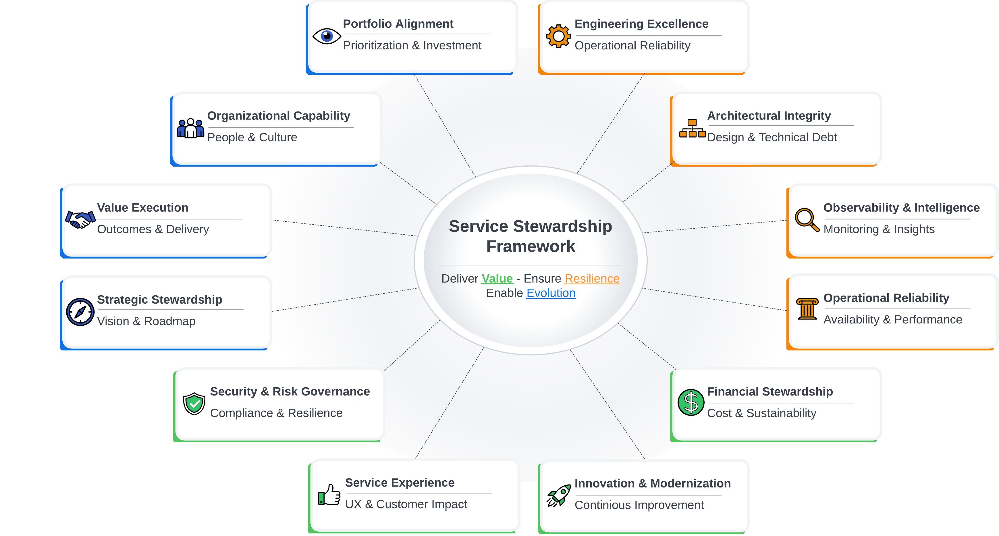

# The Service Stewardship Framework

**Version:** v1.1 
**Last Updated:** March 2026  

---
## Who This Is For

- Engineering Managers responsible for long-lived services
- Platform and SRE leaders
- Technology executives governing reliability-critical systems

## Overview

The Service Stewardship Framework defines what it truly means to own and evolve a technology service responsibly.

In many organizations, service ownership is implied but rarely defined. Engineering managers are expected to “own the service,” yet ownership often defaults to uptime, incident response, and backlog management.

This framework expands that definition.

It establishes a structured, multidimensional model for stewarding services across strategy, delivery, reliability, architecture, security, finance, and organizational capability.

The goal is practical leadership, not theory.

## What Makes This Different

This framework is:
- Multidimensional, not uptime-focused
- Governance-oriented, not documentation-driven
- Evidence-based, not aspirational
- Designed for long-lived enterprise services

---

## Start Here

If you are new to the framework, follow this recommended reading order:

1. [Introduction](docs/introduction.md)  
   Understand the leadership philosophy and intent behind the model.

2. [Framework Definition](docs/framework.md)  
   Review the 12 domains and their core responsibilities.

3. [Maturity Model](maturity-model/README.md)  
   Understand the four-level progression model.

4. [Assessment Questionnaire](assessments/service-maturity-assessment.md)  
   Establish your baseline maturity score.

5. [How to Use Guide](docs/how-to-use.md)  
   Learn how to operationalize the framework in practice.

---

## The 12 Domains of Service Stewardship

The framework organizes service ownership into twelve interconnected domains:

1. Strategic Stewardship  
2. Organizational Capability  
3. Value Execution  
4. Engineering Excellence  
5. Operational Reliability  
6. Architectural Integrity  
7. Service Experience  
8. Security & Risk Governance  
9. Financial Stewardship  
10. Observability & Intelligence  
11. Innovation & Modernization  
12. Portfolio Alignment  

Each domain defines:

- Core responsibilities  
- Key metrics  
- Governance expectations  
- Required artifacts  
- Maturity progression  

Together, they form a complete operating model for durable service ownership.

See full definitions here:\
[Framework Definition](docs/framework.md)

---

## Maturity Model

The framework embeds a four-level maturity progression:

- **Level 1: Reactive**
- **Level 2: Managed**
- **Level 3: Optimized**
- **Level 4: Proactive**

Progression is evidence-based and staged.  

The maturity model allows leaders to:

- Diagnose current state honestly  
- Identify structural gaps  
- Prioritize investment intentionally  
- Track measurable improvement over time  

See full details here:
[Maturity Model Overview](maturity-model/README.md)

---

## Assessment & Domain Modules

The framework includes structured instruments for evaluation and improvement.

### Assessment

Use the consolidated questionnaire to baseline maturity across all domains:

[Service Maturity Assessment](assessments/service-maturity-assessment.md)

### Domain Modules

Each domain includes a deep-dive operational guide that provides:

- Detailed expectations  
- Governance cadence  
- Implementation guidance  
- Evidence requirements  
- Improvement pathways  

Explore domain modules in:

[Modules Directory](modules/)

---

## How to Operationalize the Framework

This framework is designed to be applied, not archived.

Use it to:

- Conduct structured service reviews  
- Identify systemic risk exposure  
- Align roadmap investment to value  
- Improve cross-functional governance  
- Strengthen organizational capability  

Step-by-step guidance is available here:

[How to Use the Framework](docs/how-to-use.md)

## Repository Navigation

- Framework overview: `docs/framework.md`
- Domain modules: `modules/`
- Operational playbooks: `playbooks/`
- Assessment modules: `assessments/modules/`
- Maturity model: `maturity-model/`